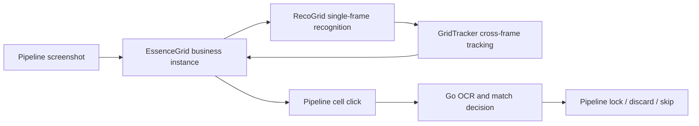

# RecoGrid / GridTracker / EssenceGrid Architecture

Essence inventory scanning is composed from three C++ modules instead of one
stateful engine that owns recognition, tracking, classification, and business
flow.



## Module boundaries

| Module | Owns | Does not own |
| --- | --- | --- |
| `RecoGrid` | Rows, columns, cell rectangles, occupancy, pHash, and comparison features for one image | Frame history, scroll order, business quality, clicks |
| `GridTracker` | Adjacent-frame alignment, global coordinates, deduplication, order, and end confirmation | Image segmentation, template loading, Pipeline routing |
| `EssenceGrid` | Essence quality, lock/discard thumbnails, pending queue, and Maa callbacks | Skill OCR, match rules, UI actions |
| Go `essencefilter` | OCR normalization, target matching, Lock/Discard/Skip decisions, and reports | Grid recognition and button clicks |
| Pipeline | Screenshot timing, clicks, swipes, waits, and post-action verification | Image algorithms and match data structures |

Source-level documentation:

- [RecoGrid README](../../../../agent/cpp-algo/source/RecoGrid/README.md)
- [GridTracker README](../../../../agent/cpp-algo/source/GridTracker/README.md)
- [EssenceGrid README](../../../../agent/cpp-algo/source/EssenceGridScan/README.md)
- [EssenceFilter Go README](../../../../agent/go-service/essencefilter/README.md)

## RecoGrid: one frame only

```cpp
recogrid::GridFrame RecognizeGrid(
    const cv::Mat& image,
    const recogrid::GridRecognitionOptions& options = {});
```

Recognition performs these steps:

1. map the screenshot to `normalizedSize`;
2. crop `roi` and detect row/column projection segments;
3. construct regular cells and project them back to screenshot coordinates;
4. mask fixed cell decorations;
5. compute occupancy, pHash, and compact color features.

### Main inputs

| Field | Meaning |
| --- | --- |
| `detect.normalizedSize` | Coordinate base; MaaEnd normally uses `1280x720` |
| `detect.roi` | Grid region |
| row/column threshold ratios | Projection thresholds |
| `minRawSegmentLength` | Minimum raw segment length |
| `minKeptSegmentRatio` | Segment size retained relative to the modal cell size |
| `lockedRowHeight` / `lockedColWidth` | Cell size locked after the first frame to stabilize later detection |
| `mask` | Fixed decorations excluded inside each cell |
| occupancy brightness options | Decide whether a cell contains content |

`GridFrame` contains shape, modal cell size, diagnostics, and `GridCell`
values. Each cell stores local coordinates, frame index, screen rectangle,
features, and `occupied`.

RecoGrid does not load item-classification templates or keep sessions. Invalid
input returns an empty frame and lets the caller choose the retry policy.

## GridTracker: order across frames

```cpp
gridtracker::Result observe(
    const recogrid::GridFrame& frame,
    const gridtracker::Options& options = {});
```

Keep one tracker per scrolling task and call `reset()` for a new task.

| Status | Meaning | EssenceGrid route |
| --- | --- | --- |
| `Initial` | First valid frame | Process new cells, then scroll if empty |
| `Advanced` | Forward progress or a shape refresh that does not prove the end | Process new cells, then scroll if empty |
| `ConfirmingEnd` | First complete repeat | Scroll once more |
| `Repeated` | Second consecutive complete repeat | Finish |
| `Rejected` | Empty, incompatible, or low-confidence frame | Return recognition failure and retry the same node |

The tracker evaluates non-negative row offsets in the previous frame. It
prefers a higher match ratio, then lower average feature distance, then more
compared cells. A candidate must also satisfy minimum overlap rows and
`min_match_ratio`.

Accepted occupied cells are placed at
`(viewport_start_row + local_row, col)`. Business code should consume
`Result::new_cells` and must not maintain another coordinate-deduplication map.

### Complete end confirmation

A zero offset is not sufficient. A complete repeat requires:

- identical row and column shape;
- complete `rows * cols` cell vectors in both frames;
- every cell participating in comparison;
- `repeat_match_ratio` being met.

The first complete repeat returns `ConfirmingEnd`; only the second consecutive
repeat returns `Repeated`. Progress, shape changes, and rejected comparisons
clear pending confirmation.

## EssenceGrid: the business instance

`main.cpp` creates one `EssenceGrid` and passes it through `trans_arg` to:

- `EssenceGridAdvanceRecognition`;
- `EssenceGridPendingRecognition`.

The instance owns one tracker, task id, merged configuration, thumbnail
templates, the latest result, page queue, queue cursor, and pending cell. A new
task id resets tracking and queue state.

### `EssenceGridAdvance.attach`

| Field | Consumer |
| --- | --- |
| Grid ROI, normalized size, projection and segment settings | RecoGrid |
| `repeat_match_ratio` | GridTracker |
| lock/discard thumbnail paths | Essence thumbnail classification |
| `flawless_essence` / `pure_essence` | Essence quality filter |
| `skip_thumb_lock` / `skip_thumb_discard` | Essence dispatch filter |

MaaFramework dictionary-merges base resources, task options, and controller
overrides before C++ reads the final node data. Do not mirror these fields in Go.

### Queue construction

EssenceGrid processes only tracker `new_cells`:

1. sample the bottom strip for gold/purple quality;
2. match lock/discard thumbnails in the lower-left cell region;
3. apply quality and thumbnail filters;
4. enqueue accepted cells;
5. expose the pending screen rectangle for Pipeline to click.

## Go and Pipeline

After Pipeline clicks a cell, Pipeline OCR nodes read three skills and levels.
Go normalizes the OCR result, performs matching, and chooses one actual action
entry: `LockItem`, `DiscardItem`, or the skip route.

Pipeline owns button recognition, clicking, and `CheckLocked` /
`CheckDiscarded` verification. Go must not route directly to a post-action
check node, because doing so skips the operation.

## Controller overrides

The base resource defines Win32 geometry. `resource_adb` and other controller
resources should override only geometry, templates, and swipe parameters that
actually differ.

Lock and discard buttons need separate ROIs. A Pipeline `Click` uses the box
returned by template matching; one broad ROI can let a similar template select
the neighboring button.

## Troubleshooting

| Symptom | First owner to inspect |
| --- | --- |
| Wrong rows, columns, or cell rectangles | RecoGrid ROI and segment settings |
| Wrong cumulative order, duplicates, or early finish | GridTracker offset, support, match ratio, and status |
| Wrong quality or lock/discard thumbnail state | EssenceGrid HSV and templates |
| Unexpected skill match | Go normalization, data, and match options |
| Wrong or unconfirmed lock/discard click | Pipeline template, ROI, waits, and next order |

## Build

The production executable composes all three modules:

```powershell
cmake --build agent\cpp-algo\build --config RelWithDebInfo --target cpp-algo
```

`recogrid` and `grid-tracker` are independent static CMake libraries;
EssenceGrid is compiled into `cpp-algo`.
