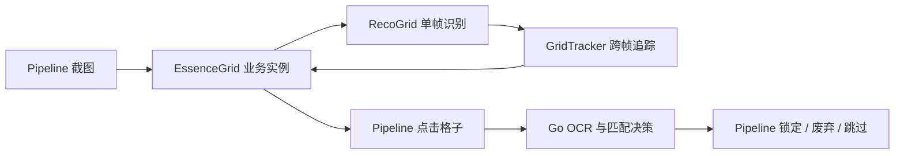

# RecoGrid / GridTracker / EssenceGrid 架构指南

基质库存扫描由三个可独立理解的 C++ 模块组成，不再由单体引擎包办识别、追踪和业务流程：



## 模块边界

| 模块 | 负责 | 不负责 |
| --- | --- | --- |
| `RecoGrid` | 单张截图中的行列、格子矩形、占用状态、pHash 和比较特征 | 历史帧、滚动顺序、业务品质、点击 |
| `GridTracker` | 相邻帧对齐、全局行列、去重、顺序和结束确认 | 图像分割、模板加载、Pipeline 路由 |
| `EssenceGrid` | 基质品质、锁定/废弃缩略图、待处理队列和 Maa 回调 | 技能 OCR、匹配规则、实际 UI 操作 |
| Go `essencefilter` | OCR 归一化、目标组合匹配、Lock/Discard/Skip 决策 | 网格识别、点击按钮 |
| Pipeline | 截图时机、点击、滑动、等待、操作后确认 | 图像算法和匹配数据结构 |

源码旁还有更精确的模块文档：

- [RecoGrid README](../../../../agent/cpp-algo/source/RecoGrid/README.md)
- [GridTracker README](../../../../agent/cpp-algo/source/GridTracker/README.md)
- [EssenceGrid README](../../../../agent/cpp-algo/source/EssenceGridScan/README.md)
- [EssenceFilter Go README](../../../../agent/go-service/essencefilter/README.md)

## RecoGrid：只识别一帧

公共入口：

```cpp
recogrid::GridFrame RecognizeGrid(
    const cv::Mat& image,
    const recogrid::GridRecognitionOptions& options = {});
```

识别过程：

1. 把截图映射到 `normalizedSize`。
2. 裁剪 `roi`，通过行列投影提取 segment。
3. 组合出规则格子并换算回原截图坐标。
4. 对每个格子应用固定装饰 mask。
5. 计算占用状态、pHash 和紧凑颜色特征。

### 主要输入

| 字段 | 含义 |
| --- | --- |
| `detect.normalizedSize` | 坐标基准，MaaEnd 通常使用 `1280x720` |
| `detect.roi` | 网格区域 |
| `rowThresholdRatio` / `colThresholdRatio` | 行列投影阈值 |
| `minRawSegmentLength` | 原始 segment 最小长度 |
| `minKeptSegmentRatio` | 相对主流格子尺寸的保留比例 |
| `lockedRowHeight` / `lockedColWidth` | 首帧后锁定的格子尺寸，用于稳定后续检测 |
| `mask` | 忽略格子内固定角标或底部区域 |
| 占用亮度参数 | 判断格子是否有内容 |

### 主要输出

`GridFrame` 包含行列数、主流格子宽高、诊断信息和 `GridCell` 列表。每个 `GridCell` 包含局部行列、当前帧 index、屏幕矩形、特征以及 `occupied`。

RecoGrid 不加载物品分类模板，也不保存 session。空图、无效通道或没有检测到网格时返回空 `GridFrame`，调用方决定如何重试。

## GridTracker：跨帧顺序与结束

公共入口：

```cpp
gridtracker::Result observe(
    const recogrid::GridFrame& frame,
    const gridtracker::Options& options = {});
```

一个滚动任务持有一个 `GridTracker`。新任务开始时调用 `reset()`。

### 状态

| 状态 | 含义 | EssenceGrid 路由 |
| --- | --- | --- |
| `Initial` | 首个有效帧 | 处理新格子；无候选则滑动 |
| `Advanced` | 正向推进，或形状变化后刷新基准 | 处理新格子；无候选则滑动 |
| `ConfirmingEnd` | 第一次完整重复 | 再滑一次确认 |
| `Repeated` | 连续第二次完整重复 | 完成任务 |
| `Rejected` | 空帧、列数变化或低置信对齐 | 返回识别失败，让 Maa 同屏重试 |

### 对齐与去重

Tracker 在前一帧中枚举非负行偏移，按以下顺序选择候选：

1. 匹配格比例更高；
2. 平均特征距离更低；
3. 参与比较的格子更多。

候选还必须满足最小重叠行数和 `min_match_ratio`。接受正偏移后，本地行会映射为 `viewport_start_row + local_row`。

业务层只消费 `Result::new_cells`。Tracker 已按全局 `(row, col)` 去重，外层不要再维护第二份去重表。

### 为什么结束要确认两次

`row_offset == 0` 不能单独证明到底。一次完整重复必须同时满足：

- 两帧行列形状一致；
- 两帧都具有完整的 `rows * cols` 格子向量；
- 全部格子参与比较；
- 匹配比例达到 `repeat_match_ratio`。

第一次返回 `ConfirmingEnd`，Pipeline 再滑一次。第二次连续满足条件才返回 `Repeated`。任何有效推进、形状变化或失败识别都会清除待确认状态。

## EssenceGrid：基质业务实例

`main.cpp` 创建一个 `EssenceGrid`，并通过 `trans_arg` 同时注册：

- `EssenceGridAdvanceRecognition`
- `EssenceGridPendingRecognition`

实例持有 Tracker、任务 id、合并后的配置、缩略图模板、当前页队列和 pending cell。任务 id 变化时会重置 Tracker 与队列。

### `EssenceGridAdvance.attach`

| 字段 | 用途 |
| --- | --- |
| `roi`、`normalized_size`、行列阈值、segment 参数 | 构造 RecoGrid 选项 |
| `repeat_match_ratio` | 构造 GridTracker 选项 |
| `thumb_lock_template_paths` | 识别已锁定缩略图 |
| `thumb_discard_template_path` | 识别已废弃缩略图 |
| `flawless_essence` / `pure_essence` | 品质过滤 |
| `skip_thumb_lock` / `skip_thumb_discard` | 缩略图状态过滤 |

MaaFramework 会先把基础资源、任务选项和控制器资源字典合并，C++ 再从 `MaaContextGetNodeData` 读取最终 `attach`。不要在 Go 中再复制这些字段。

### 队列构建

EssenceGrid 只处理 Tracker 的 `new_cells`：

1. 采样格子底部颜色判断无暇/高纯。
2. 在格子左下区域匹配锁定/废弃缩略图。
3. 应用品质与跳过选项。
4. 把通过的格子加入队列。
5. `PendingRecognition` 返回屏幕矩形，Pipeline 执行点击。

## Go 与 Pipeline

Pipeline 点击格子后，三个技能和等级由 OCR 节点读取。Go 的 `runUnifiedSkillDecision` 只决定分支：

- 命中目标：进入 `LockItem`；
- 未命中且开启废弃：进入 `DiscardItem`；
- 其他情况：回到 `EssenceGridAdvance`。

实际按钮识别、点击和 `CheckLocked` / `CheckDiscarded` 确认都属于 Pipeline。Go 不能直接跳到确认节点，否则会跳过动作。

## 控制器差异

基础资源定义 Win32 几何；`resource_adb` 等控制器资源只覆盖确实不同的 ROI、模板和滑动参数。

锁定与废弃按钮必须使用彼此独立的 ROI。`Click` 会点击模板匹配返回的 box；把两个按钮放进同一个大 ROI，可能让相似模板命中相邻按钮。

## 排查入口

| 现象 | 先查哪一层 |
| --- | --- |
| 行列数或格子矩形错误 | RecoGrid 的 ROI 和 segment 参数 |
| 累计错行、重复、提前结束 | GridTracker 的 offset、support、match ratio 和状态 |
| 品质或已锁/已弃判断错误 | EssenceGrid 的 HSV 与缩略图模板 |
| 技能匹配不符合预期 | Go OCR 归一化、数据和匹配选项 |
| 锁定/废弃按钮点错或不确认 | Pipeline 模板、ROI、等待和 next 顺序 |

## 构建

三个模块最终由生产 `cpp-algo` 组合：

```powershell
cmake --build agent\cpp-algo\build --config RelWithDebInfo --target cpp-algo
```

CMake 中 `recogrid` 与 `grid-tracker` 是独立静态库；`EssenceGrid` 编译进 `cpp-algo`。
